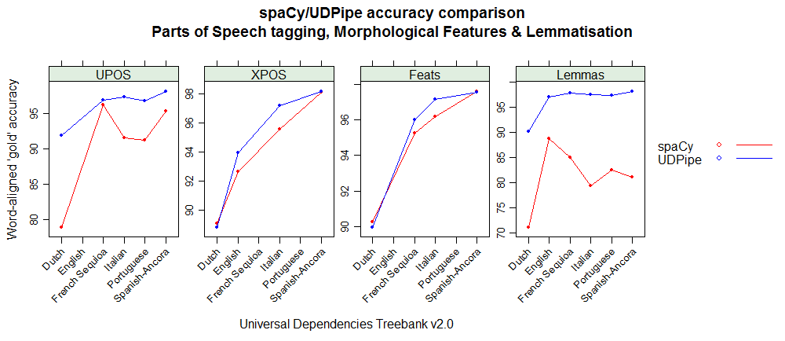
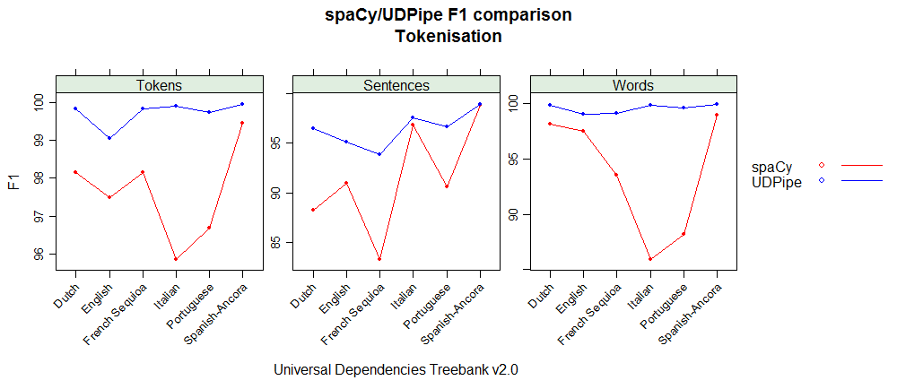
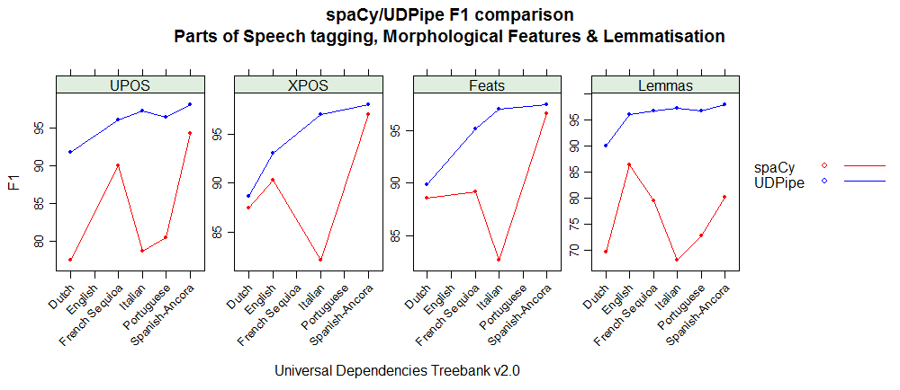
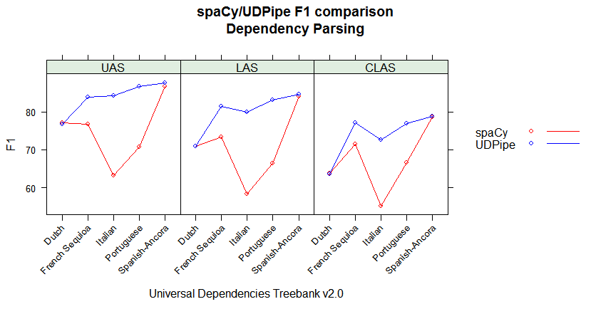

This repository uses the CONLL-U evaluation script available at https://github.com/ufal/conll2017 to make a comparison regarding accuracy between UDPipe models and Spacy models which are trained on the same treebanks. In order to do the comparison, the evaluation script used in the CoNLL 2017 Shared Task explained at http://universaldependencies.org/conll17/evaluation.html is used.

- It does this evaluation for French (UD_French-Sequoia treebank), Dutch (UD_Dutch treebank), Spanish (UD_Spanish-Ancora treebank), Portuguese (UD_Portuguese treebank), Italian (UD_Italian treebank) and English (UD_English treebank)
- The udpipe and spacy models used for evaluation were trained on the same treebanks from www.universaldependencies.org except for English. For English the udpipe models are constructed on a different treebank (UD_English) than the model which was built by spacy (which was trained on the Ontonotes treebank). All models were trained on the training set of each of the respective treebanks, while evalution shown below is executed on the left out test set.
- For the spacy models, we took the models currently available for download as in python -m spacy download es` (spaCy Version: 2.0.7), these were build on version 2.0 of the UD treebanks. For the udpipe models, the official models provided by the udpipe authors which were trained on 2017-08-01 on version 2.0-test of the treebanks were used (models available at https://github.com/jwijffels/udpipe.models.ud.2.0). Except for English, for which we built a model on 2018-01-11 on the newest version 2.1 of the UD_English treebank (code for this is openly available at https://github.com/bnosac/udpipe.models.ud). 
- Code was run on 2018-02-11. Just run the R script udpipe-spacy-comparison.R if you want to reproduce this. Code run on a Ubuntu Linux machine with LANG nl_BE.UTF-8.

Below the output is reported from the CONLL17 evaluation scripts for the udpipe and spacy models. 
The most used results are the one from AligndAcc which indicate Gold accuracies which means that if we know the tokenisation, how good would the parts-of-speech tagging, morphological feature tagging and dependency parsing be.

## Overall comparison graphs

The following shows the graphs comparing the UDPipe and spaCy models using the evaluation script used in the CoNLL 2017 Shared Task. 
It shows the word-aligned accuracies of the different NLP tasks and also the F1 measure.

### Aligned Accuracies




### F1 measure





## Conclusion 

You can look at the numbers below but when looking at the metrics below `AligndAcc`, they seem to give the following conclusion:

- French (UD_French-Sequoia treebank) udpipe gives better accuracies than spacy regarding all accuracy metrics
- Dutch (UD_Dutch treebank): udpipe better regarding upos/lemmatising than spacy, xpos is similar between udpipe & spacy, spacy better regarding dependency parsing
- Spanish (UD_Spanish-Ancora treebank): udpipe gives better accuracies than spacy on parts of speech tagging and lemmatisation while they are pretty much on par regarding dependencies
- Portuguese (UD_Portuguese Bosque treebank): udpipe gives better accuracies than spacy regarding all accuracy metrics
- Italian (UD_Italian treebank): udpipe gives better accuracies than spacy regarding all accuracy metrics
- English (UD_English treebank): udpipe gives better accuracies than spacy regarding universal and penn-treebank based parts of speech tagging but the spacy model was built on the Ontonotes treebank while the udpipe model was trained on the training set of the UD_English treebank so this might as well been caused by general treebank differences

# French Sequioa

Evaluation data from https://github.com/UniversalDependencies/UD_French-Sequoia release 2.0-test

Notes: This treebank does not contain xpos so measures of XPOS are irrelevant.

## udpipe

```
> system("python evaluation_script/conll17_ud_eval.py -v gold.conllu predictions_udpipe.conllu")
Metrics    | Precision |    Recall |  F1 Score | AligndAcc
-----------+-----------+-----------+-----------+-----------
Tokens     |     99.84 |     99.85 |     99.84 |
Sentences  |     92.00 |     95.83 |     93.88 |
Words      |     98.90 |     99.36 |     99.13 |
UPOS       |     95.81 |     96.26 |     96.03 |     96.88
XPOS       |     98.90 |     99.36 |     99.13 |    100.00
Feats      |     94.95 |     95.39 |     95.17 |     96.00
AllTags    |     93.88 |     94.32 |     94.10 |     94.92
Lemmas     |     96.62 |     97.07 |     96.85 |     97.70
UAS        |     83.77 |     84.16 |     83.96 |     84.70
LAS        |     81.19 |     81.57 |     81.38 |     82.09
CLAS       |     77.25 |     76.82 |     77.03 |     76.98
```

## spacy

```
> system("python evaluation_script/conll17_ud_eval.py -v gold.conllu predictions_spacy.conllu")
Metrics    | Precision |    Recall |  F1 Score | AligndAcc
-----------+-----------+-----------+-----------+-----------
Tokens     |     97.53 |     98.80 |     98.16 |
Sentences  |     78.49 |     88.82 |     83.33 |
Words      |     94.41 |     92.69 |     93.54 |
UPOS       |     90.84 |     89.18 |     90.00 |     96.22
XPOS       |     94.41 |     92.69 |     93.54 |    100.00
Feats      |     89.94 |     88.30 |     89.11 |     95.27
AllTags    |     88.87 |     87.25 |     88.06 |     94.14
Lemmas     |     80.21 |     78.75 |     79.47 |     84.96
UAS        |     77.38 |     75.97 |     76.67 |     81.96
LAS        |     74.12 |     72.77 |     73.43 |     78.51
CLAS       |     71.35 |     71.76 |     71.56 |     73.65
```

# Dutch

Evaluation data from https://github.com/UniversalDependencies/UD_Dutch release 2.0-test

Notes: None

## udpipe

```
> system("python evaluation_script/conll17_ud_eval.py -v gold.conllu predictions_udpipe.conllu")
Metrics    | Precision |    Recall |  F1 Score | AligndAcc
-----------+-----------+-----------+-----------+-----------
Tokens     |     99.85 |     99.83 |     99.84 |
Sentences  |     95.30 |     97.66 |     96.47 |
Words      |     99.85 |     99.83 |     99.84 |
UPOS       |     91.74 |     91.71 |     91.72 |     91.87
XPOS       |     88.71 |     88.68 |     88.69 |     88.84
Feats      |     89.82 |     89.80 |     89.81 |     89.95
AllTags    |     87.59 |     87.57 |     87.58 |     87.72
Lemmas     |     90.01 |     89.99 |     90.00 |     90.14
UAS        |     76.79 |     76.77 |     76.78 |     76.91
LAS        |     70.95 |     70.93 |     70.94 |     71.05
CLAS       |     63.92 |     63.11 |     63.51 |     63.22
```

## spacy

```
> system("python evaluation_script/conll17_ud_eval.py -v gold.conllu predictions_spacy.conllu")
Metrics    | Precision |    Recall |  F1 Score | AligndAcc
-----------+-----------+-----------+-----------+-----------
Tokens     |     97.30 |     99.02 |     98.15 |
Sentences  |     84.91 |     91.97 |     88.30 |
Words      |     97.30 |     99.02 |     98.15 |
UPOS       |     76.81 |     78.16 |     77.48 |     78.94
XPOS       |     86.71 |     88.24 |     87.47 |     89.11
Feats      |     87.82 |     89.36 |     88.58 |     90.25
AllTags    |     73.29 |     74.58 |     73.93 |     75.32
Lemmas     |     69.16 |     70.38 |     69.77 |     71.08
UAS        |     76.51 |     77.85 |     77.17 |     78.62
LAS        |     70.35 |     71.59 |     70.97 |     72.30
CLAS       |     63.02 |     64.52 |     63.76 |     65.57
```

# Spanish-Ancora

Evaluation data from https://github.com/UniversalDependencies/UD_Spanish-Ancora release 2.0-test

Notes: None

## udpipe

```
> system("python evaluation_script/conll17_ud_eval.py -v gold.conllu predictions_udpipe.conllu")
Metrics    | Precision |    Recall |  F1 Score | AligndAcc
-----------+-----------+-----------+-----------+-----------
Tokens     |     99.96 |     99.96 |     99.96 |
Sentences  |     98.62 |     99.30 |     98.96 |
Words      |     99.95 |     99.94 |     99.94 |
UPOS       |     98.10 |     98.10 |     98.10 |     98.16
XPOS       |     98.10 |     98.10 |     98.10 |     98.16
Feats      |     97.49 |     97.48 |     97.49 |     97.54
AllTags    |     96.84 |     96.83 |     96.83 |     96.89
Lemmas     |     98.09 |     98.08 |     98.08 |     98.14
UAS        |     87.72 |     87.71 |     87.72 |     87.76
LAS        |     84.60 |     84.59 |     84.59 |     84.64
CLAS       |     78.93 |     78.75 |     78.84 |     78.84
```

## spacy

```
> system("python evaluation_script/conll17_ud_eval.py -v gold.conllu predictions_spacy.conllu")
Metrics    | Precision |    Recall |  F1 Score | AligndAcc
-----------+-----------+-----------+-----------+-----------
Tokens     |     99.23 |     99.69 |     99.46 |
Sentences  |     98.44 |     99.24 |     98.84 |
Words      |     98.88 |     98.99 |     98.93 |
UPOS       |     94.23 |     94.34 |     94.28 |     95.30
XPOS       |     96.96 |     97.08 |     97.02 |     98.06
Feats      |     96.53 |     96.64 |     96.58 |     97.62
AllTags    |     93.02 |     93.12 |     93.07 |     94.07
Lemmas     |     80.20 |     80.29 |     80.24 |     81.11
UAS        |     86.67 |     86.77 |     86.72 |     87.66
LAS        |     83.96 |     84.06 |     84.01 |     84.92
CLAS       |     78.85 |     78.56 |     78.70 |     80.06
```

# Portuguese

Evaluation data from https://github.com/UniversalDependencies/UD_Portuguese release 2.0-test

Notes: spacy does not return morphological features resulting in incorrect evaluation numbers for spacy on Feats and AllTags

## udpipe

```
> system("python evaluation_script/conll17_ud_eval.py -v gold.conllu predictions_udpipe.conllu")
Metrics    | Precision |    Recall |  F1 Score | AligndAcc
-----------+-----------+-----------+-----------+-----------
Tokens     |     99.69 |     99.77 |     99.73 |
Sentences  |     95.50 |     97.90 |     96.69 |
Words      |     99.52 |     99.69 |     99.60 |
UPOS       |     96.35 |     96.51 |     96.43 |     96.81
XPOS       |     72.73 |     72.86 |     72.79 |     73.08
Feats      |     93.35 |     93.51 |     93.43 |     93.80
AllTags    |     71.64 |     71.76 |     71.70 |     71.98
Lemmas     |     96.79 |     96.95 |     96.87 |     97.26
UAS        |     86.58 |     86.73 |     86.65 |     87.00
LAS        |     83.04 |     83.18 |     83.11 |     83.44
CLAS       |     77.27 |     76.70 |     76.98 |     77.06
```

## spacy

```
> system("python evaluation_script/conll17_ud_eval.py -v gold.conllu predictions_spacy.conllu")
Metrics    | Precision |    Recall |  F1 Score | AligndAcc
-----------+-----------+-----------+-----------+-----------
Tokens     |     95.32 |     98.10 |     96.69 |
Sentences  |     87.50 |     93.92 |     90.60 |
Words      |     90.32 |     86.21 |     88.22 |
UPOS       |     82.41 |     78.65 |     80.48 |     91.23
XPOS       |     60.34 |     57.59 |     58.94 |     66.81
Feats      |     30.47 |     29.09 |     29.76 |     33.74
AllTags    |     24.23 |     23.13 |     23.66 |     26.83
Lemmas     |     74.53 |     71.13 |     72.79 |     82.51
UAS        |     72.49 |     69.19 |     70.80 |     80.26
LAS        |     68.08 |     64.97 |     66.49 |     75.37
CLAS       |     65.28 |     68.14 |     66.68 |     69.30
```

# Italian

Evaluation data from https://github.com/UniversalDependencies/UD_Italian release 2.0-test

Notes: None

## udpipe

```
> system("python evaluation_script/conll17_ud_eval.py -v gold.conllu predictions_udpipe.conllu")
Metrics    | Precision |    Recall |  F1 Score | AligndAcc
-----------+-----------+-----------+-----------+-----------
Tokens     |     99.91 |     99.92 |     99.91 |
Sentences  |     96.73 |     98.34 |     97.53 |
Words      |     99.82 |     99.85 |     99.83 |
UPOS       |     97.21 |     97.24 |     97.22 |     97.38
XPOS       |     97.01 |     97.03 |     97.02 |     97.18
Feats      |     96.99 |     97.01 |     97.00 |     97.16
AllTags    |     96.10 |     96.13 |     96.12 |     96.28
Lemmas     |     97.28 |     97.31 |     97.30 |     97.46
UAS        |     88.90 |     88.92 |     88.91 |     89.06
LAS        |     86.20 |     86.22 |     86.21 |     86.36
CLAS       |     79.81 |     79.49 |     79.65 |     79.67
```

## spacy

```
> system("python evaluation_script/conll17_ud_eval.py -v gold.conllu predictions_spacy.conllu")
Metrics    | Precision |    Recall |  F1 Score | AligndAcc
-----------+-----------+-----------+-----------+-----------
Tokens     |     97.10 |     94.66 |     95.86 |
Sentences  |     95.74 |     97.93 |     96.82 |
Words      |     90.39 |     81.89 |     85.93 |
UPOS       |     82.75 |     74.96 |     78.66 |     91.55
XPOS       |     86.39 |     78.27 |     82.13 |     95.58
Feats      |     86.96 |     78.78 |     82.66 |     96.20
AllTags    |     81.78 |     74.09 |     77.75 |     90.48
Lemmas     |     71.73 |     64.98 |     68.19 |     79.36
UAS        |     70.98 |     64.30 |     67.47 |     78.52
LAS        |     67.31 |     60.98 |     63.99 |     74.47
CLAS       |     59.85 |     61.85 |     60.84 |     66.76
```

# English (mark udpipe trained on UD_English, spacy was trained on Ontonotes)

Evaluation data from https://github.com/UniversalDependencies/UD_English release 2.1

Notes:

- udpipe was trained on UD_English while spacy was trained on OntoNotes which is a different treebank than the udpipe model which makes comparison tricky
- spacy does not return morphological features + it seems that dependency relationships do not follow the same format as universaldependencies.org giving probably false evaluation metrics on UAS and LAS
- This all indicates that probably only the metrics on upos and xpos are relevant for comparison
- also removed sentence newsgroup-groups.google.com_n3td3v_e874a1e5eb995654_ENG_20060120_052200-0011 from the test dataset as it contained non-UTF-8 characters

## udpipe

```
> system("python evaluation_script/conll17_ud_eval.py -v gold.conllu predictions_udpipe.conllu")
Metrics    | Precision |    Recall |  F1 Score | AligndAcc
-----------+-----------+-----------+-----------+-----------
Tokens     |     99.15 |     98.94 |     99.05 |
Sentences  |     93.49 |     96.82 |     95.13 |
Words      |     99.15 |     98.94 |     99.05 |
UPOS       |     93.77 |     93.58 |     93.68 |     94.58
XPOS       |     93.15 |     92.95 |     93.05 |     93.95
Feats      |     94.59 |     94.40 |     94.50 |     95.41
AllTags    |     91.81 |     91.61 |     91.71 |     92.59
Lemmas     |     96.16 |     95.96 |     96.06 |     96.99
UAS        |     83.09 |     82.91 |     83.00 |     83.80
LAS        |     79.97 |     79.80 |     79.88 |     80.65
CLAS       |     76.20 |     75.95 |     76.07 |     76.81
```

## spacy

```
> system("python evaluation_script/conll17_ud_eval.py -v gold.conllu predictions_spacy.conllu")
Metrics    | Precision |    Recall |  F1 Score | AligndAcc
-----------+-----------+-----------+-----------+-----------
Tokens     |     96.71 |     98.26 |     97.48 |
Sentences  |     87.70 |     94.46 |     90.96 |
Words      |     96.71 |     98.26 |     97.48 |
UPOS       |     79.93 |     81.21 |     80.56 |     82.65
XPOS       |     89.60 |     91.04 |     90.31 |     92.65
Feats      |     32.51 |     33.03 |     32.77 |     33.62
AllTags    |     27.65 |     28.09 |     27.87 |     28.59
Lemmas     |     85.79 |     87.17 |     86.48 |     88.72
UAS        |     56.00 |     56.90 |     56.44 |     57.90
LAS        |     42.46 |     43.15 |     42.80 |     43.91
CLAS       |     36.69 |     43.30 |     39.72 |     44.14
```

# German

Not executed as the spacy model is built on a different treebank, which will give similar remarks as encountered in the English evaluation.
